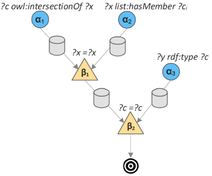

# Continuous Transactions

This repository is a fork of [Apache Jena](https://github.com/apache/jena.git).
Its goal is to implement a forward-chaining, RETE-based version of [Transaction Logic](https://en.wikipedia.org/wiki/Transaction_logic) into Jena's RETE structure. 

### TL;DR

Checkout the `org.apache.jena.reasoner.rulesys.test.tr.TestTransactionRules` class, 
and the associated built-ins, for trying out continuous transactions!

### Transaction Logic

Transaction Logic () has clear, unambiguous semantics for changes in a knowledge base (KB). In this logic, a rule has an all-or-nothing flavour, i.e., 
either all its updates are applied, or none of them are. Hence, rules can be considered as atomic transactions.

 relies on executional entailment, where establishing the truth value of an expression involves executing that expression. 
In particular, proving a query involves finding an execution path that entails the query:   

 
Where  _P_  represents a transaction base,  is an execution path, and  _ψ_  is a transaction. This entailment states that transaction  _ψ_  is entailed by execution path  given  _P_ . For example, the following holds:

When the update (or "transition")  _ins:in(pie, sky)_  is defined as inserting the atom  _in(pie, sky)_ .
 
Transaction Logic defines special semantics for logical conjunction, disjunction and negation, 
and introduces a new operator called serial conjunction (symbol ). We only utilize serial conjunction here. 
The following executional entailment:  

   

Will hold if and only if an execution path  exists
where the following holds:  and 
. 

For instance, the following entailment holds:

When transitions  _ins:lost_  and  _ins:sad_  are defined to insert atoms  _lost_  and  _sad_  into the KB, respectively. 
 
Using serial conjunction,
 allows combining updates with conditions. 
This means that pre- and post-conditions for updates are possible. For example, transaction  includes an update followed by a condition: in case "happy" is true in the final KB state, then the transaction will be committed; else, the transaction will be rolled back to the initial state. 
In other words:
 
**if**  **then** 

This notion of a post-condition makes  interesting for 
many practical applications. For example, an update can be linked to an external component (anything from a planning algorithm to a robot),
and may turn out to be unsuccessful. In that case, any prior update in the transaction will be rolled back.  

Rules are written in the form of 
, where 
 is any 
 formula and  _p_  is an atomic formula. 
This rule has a procedural interpretation: to prove p it is sufficient to prove 
, which, in line with executional entailment, 
involves executing . 

For example:

  _deposit(amt,acc) := balance(bal,acc)_ 

 _del:balance(bal, acc)_ 

 _ins:balance(bal+amt,acc)_ 

 _balance(bal2,acct)_ 

 _bal2=bal+amt_ 

In case the post-condition  _"bal2=bal+amt"_  does not hold, the  _deposit_  transaction will be rolled back.

We refer to 
[Bonner and Kifer](https://www.sciencedirect.com/science/article/pii/0304397594901902) for much more on .

### Continuous Transactions?

Transactions in  are rather considered subroutines:
invoking a query such as  _?- deposit(P, U)_  will attempt to execute the rule body of the  _deposit_  transaction, as per executional 
entailment.

However, in many dynamic scenarios, a condition may become false, or true, at any time after its initial execution. 
For instance, at runtime, an external planner may decide that a given constraint is no longer feasible, or, inversely, 
a constraint suddenly becomes feasible.
At that point, the transaction should also be rolled back or re-applied, respectively.

This is where our RETE-based implementation of 
comes in.

In a nutshell, the [RETE algorithm](https://en.wikipedia.org/wiki/Rete_algorithm) compiles a RETE structure for a given rule. 
So-called  _alpha nodes_  represent clauses within the rule, and  _beta nodes_  represent joins within the rule. 
An alpha node has an  _alpha memory_  that keeps tokens matched to the clause; 
a beta node has a  _beta memory_  that keeps tokens that were successfully joined up until that point. 

The RETE structure for an example rule is shown below (example taken from [Van Woensel et al.](https://www.researchgate.net/publication/325529409_Optimizing_Semantic_Reasoning_on_Memory-Constrained_Platforms_Using_the_RETE_Algorithm)):

**Rule**: _(?c,intersectionOf,?x),(?x,hasMember,?ci),(?y,type,?c) → (?y,type,?ci)_

**RETE**:

 
 
The  node will keep all tokens that were
successfully joined on the  _?x_  variable; 
the  node will keep all tokens that were
previously joined on the  _?x_  variable, and successfully joined on the  _?c_  variable. 
By keeping intermediate join results, a lot of join work can be avoided. 

Moreover, in our case,  _it provides us with the state that is needed to rollback prior executions of a rule_ .

### Adapted RETE algorithm

To support continuous transactions, we adapt the standard RETE algorithm as follows.

\- Each  _alpha node_  can represent a functor (or built-in) that involves issuing an update to the KB.  
When rolling back a transaction,  _alpha nodes_  will be notified in order to rollback their update.

\- The join process is extended as follows.

 (**1**)  _When joining an incoming token fails, a rollback is initiated_ .  

 Due to the nature of the RETE algorithm, we know that all prior nodes contributed to this join.  
 Hence, this rollback will propagate back to the start of the RETE structure.

 (**2**)  _When a deleted token is successfully joined, a rollback is initiated_ .   

 In this case, the rollback will proceed in both directions of the RETE structure:  

   _Prior nodes_ : due to the nature of the RETE algorithm, we know that all prior nodes contributed to this join.  
  Hence, this rollback will propagate back to the start of the RETE structure.

   _Next nodes_ : by design, the RETE algorithm will propagate the token deletion down the RETE structure;  
   since all tokens resulting from a join with this deleted token should be deleted as well.  
  Whenever this deleted token is joined to a beta node, we will issue a rollback to the connected alpha node.

### Jena Extensions:

Here, we summarize the extensions we made to the Apache Jena implementation.

##### `org.apache.jena.reasoner.rulesys.Rule.Parser` 

The rule syntax is extended with an "serial conjunction" logical operator, i.e., '`&`'. Currently, only one type of conjunction is supported per rule, i.e., a rule either contains all '`,`' (classic conjunction) or all '`&`' (serial conjunction) operators. Any rule containing the '`&`' logical operator will be considered a transaction.

##### `org.apache.jena.reasoner.rulesys.impl.RETEFunctorClause`

In case a rule clause constitutes a Functor, a `RETEFunctorClause` will be created (these clauses are compiled in `RETEEngine.RETECompiler`). Normally, these functors would be checked in the `RETETerminal` node; if they were satisified, the rule would be fired.

In a transaction rule, an alpha node may either be a classic clause filter (`RETEClauseFilter`), i.e., inserting triples matching a rule clause as tokens into the network; or constitute an elementary transition, i.e., performing a reversible task on a previously injected token. Such a transition would be implemented as a `Functor`, and hence be represented using a `RETEFunctorClause`.

##### `org.apache.jena.reasoner.rulesys.Functor`, `Builtin`

These now return whether they constitute a transitional functor / builtin, i.e., which needs to be rolled back when the rule ultimately fails.  

`Builtin` subclasses can implement the `rollback(env)` method in order to rollback a previously executed update.  

##### `org.apache.jena.reasoner.rulesys.impl.RETEJoinQueue`

In a nutshell, at the top of a RETE structure in Jena, the two root alpha nodes will each be connected to a `RETEJoinQueue`, which are linked as "siblings" to each other. A join queue is responsible for (**a**) trying to join new tokens with its sibling queue, and (**b**) keeping successfully joined tokens (i.e., it acts as both memory and beta node). In case of a third alpha node, the two initial join queues will both be connected to a third join queue, and the third alpha node will be linked to a fourth join queue, both siblings of each other. These join queues will attempt to join new tokens that were previously joined (i.e., by the prior join queues) with tokens coming directly from the third alpha node. The same structure and process applies to longer RETE structures.

In case the rule is transactional, several things may occur in a join queue:

(**1**) *An incoming token cannot be joined with the sibling join queue.*

Any prior alpha node in the RETE structure could represent an elementary transition (i.e., reversible operation); either the join queue is directly linked to such a node, or an alpha node higher up in the network is such a node. 

In the former case, the join queues will simply apply the rollback to its alpha node. In the latter case, we know that all prior alpha nodes contributed to this join (due to the nature of the RETE algorithm) so the rollback will be propagated to all those nodes. Classic clause filters will ignore a rollback, whereas functor clauses will pass on the rollback to their associated `Functor`. In case the functor represents an elementary transition, the functor will take the appropriate steps to rollback the transition.

(**2**) *A deleted token is joined with the sibling join queue.*

In this case, the rollback will proceed in both directions of the RETE structure. 

*Prior RETE structure*: since the deleted token was successfully joined with the sibling queue, we know that all prior alpha nodes contributed to this join (due to the nature of the RETE algorithm). These alpha nodes possibly elementary transitions, and these should thus be rolled back. Hence, the rollback will be propagated through the prior (i.e., higher-up) RETE structure, similar to failed joins with incoming tokens. 

*Following RETE structure*: by design, the RETE algorithm will propagate the token deletion through the rest of the RETE structure (i.e., lower-down) - this is because all tokens that resulted from a join with this deleted token should be deleted as well. In this process, whenever this deleted token is successfully joined to the sibling join queue, we will issue a rollback to the alpha node connected to the sibling join queue.

##### `org.apache.jena.reasoner.rulesys.impl.RETEPrinter`

This class prints any compiled RETE structure.
